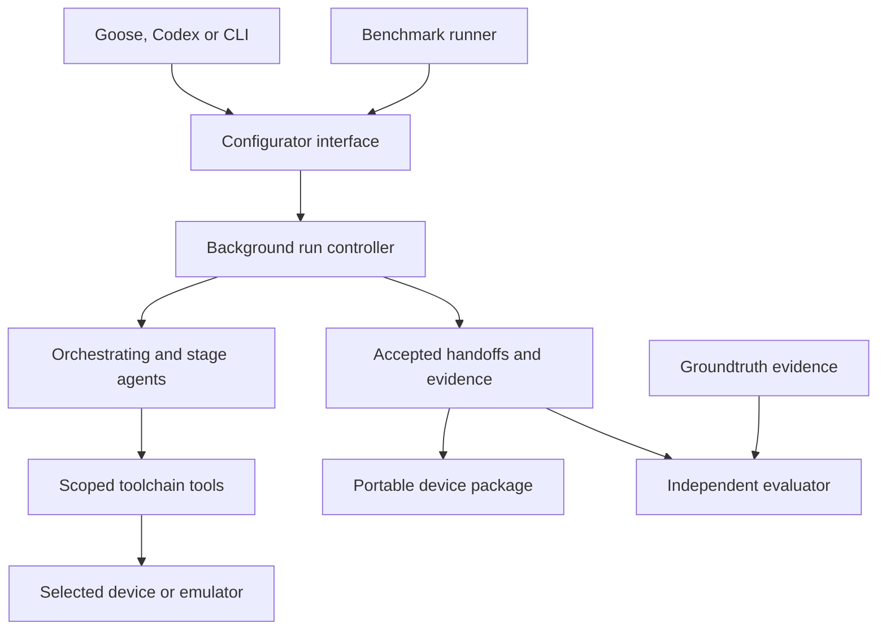

# Generative Driver: accepted design

This brief records the public repository and the six-stage workflow confirmed on 3 October 2026. Implementation follows the agreed public test seams using one failing behavior test and its implementation at a time.

## Agreed outcome

Developers can install the toolchain, skills and workflow through documented Goose or Codex setup, connect supported hardware, state an objective and inspect the resulting package and evidence. The core runs natively on macOS and Windows 11 or later. Optional analysis and benchmark dependencies may use containers.

Goose and Codex provide the developer-facing interface. A local background configurator owns the workflow, controls the orchestrating agent and stage agents, manages their configured runtime connections and device access, and retains progress independently of the UI. The first release launches configured agent runtimes rather than implementing a provider API agent loop. Codex and Goose execution adapters share the same stage contract; the runtime, provider and model identities are recorded separately.

The configurator owns six roles: acquire, interpret, probe, ground, emit and reuse. One stage is active per run. Agents make stage decisions and report their work; deterministic checks control whether reports become accepted handoffs. A run ends when a fresh agent uses the emitted driver to perform the requested device functions and independent checks accept that behavior.

## Architecture



The installed package provides the configurator, tools, portable runtime, model contracts and generic skills. Run state and outputs live in user-selected storage outside the installed package. A small CLI and MCP interface support setup checks, configuration, starting a run, reading status and evidence, supplying a requested observation, cancellation and checked recovery. Calls return a durable run identifier; reconnecting observes the same run.

The configurator records assignments, worker reports, checked handoffs and routing separately. Accepted artifacts are immutable and referenced by hashes. A worker exit code or a claim of completion cannot substitute for required check results. Model defects can return to interpret; host and operator faults route to the relevant correction without teaching the interpreter incorrect device facts.

Device bindings belong to the operator. Managed workers share exclusive device ownership through the configurator. Operations retain explicit effect grants and bounded execution. Cancellation prevents further dispatch, records the result of any outstanding operation and preserves uncertainty after interrupted writes. Recovery never silently repeats an uncertain physical action.

Blind interpret receives only its prepared description and generic kit. Fresh reuse receives only the emitted package, objective and permitted operating information. Each execution records the restrictions actually enforced. The developer-facing chat's history, benchmark answer keys and previous candidate outputs are excluded from these worker inputs.

Each benchmark uses one stable firmware image. Diagnostic observations may support bounded interpretation repairs before emission. Frozen final checks qualify the submitted package after fresh worker use; their failure is terminal.

## Public repository

The repository is `generative-driver`, with Python package `src/generative_driver/`. Original code is licensed under Apache-2.0. Existing reusable code is extracted selectively from the current working tree, including relevant uncommitted improvements. The source research repository and its frozen records are preserved.

```text
README.md                 purpose, supported paths and first successful run
src/generative_driver/       configurator, tools, runtime, packaged generic resources
plugins/                  Codex plugin and Goose installation assets
skills/                   canonical generic workflow and stage instructions
docs/                     architecture, macOS/Windows and UI setup, support matrix
tests/                    behavior tests at the agreed public seams
bench/README.md           prerequisites, run/score/compare instructions and metrics
bench/cases/              versioned benchmark inputs and execution manifests
bench/groundtruth/        independent evidence, reference vectors and evaluator keys
bench/evaluators/         scoring outside candidate access
.github/workflows/        macOS and Windows installation and behavior checks
```

The installed agent resources contain generic tools and skills. The benchmark's device sources, answers, scorers and historical outputs remain evaluator-side assets. Public evidence is selected for each worked example and retains provenance and limitations. Device recordings, vendor assets and historical Git contents are not copied wholesale. Third-party notices accompany any included third-party material.

Codex receives plugin metadata, MCP wiring and skills. Goose receives a recipe and skills with its documented MCP setup. Both connect to the same configurator. Setup documentation walks from the relevant UI through runtime selection, optional dependency checks, installation smoke, and the first supported hardware or benchmark run. A plugin installation does not by itself establish that optional native drivers or analysis tools are installed.

## Benchmark profiles

| Profile | Execution | Evidence and purpose |
|---|---|---|
| Installation check | Scripted fixture and recorded replay, no paid inference or hardware | Exercises installed CLI/MCP, workflow records, package emission and independent package replay. Labelled as setup smoke, excluded from model-performance scores. |
| Emulated STM32 families | Actual configured agents against owned TQ9, sampled-sensor and parameter-store firmware in Renode | Independent observations score readings, effects and state transitions, followed by package-only use by a fresh agent. |
| Physical BME280 sensor | Optional real sensor and supported adapter, with operator-supplied reference measurements | Exercises actual transport and fresh reuse against physical observations. Its score remains distinguishable from emulation and replay. |

Protocol checks and semantic correctness receive separate evidence. A valid frame or executable package can still return the wrong value or perform the wrong effect. Fresh reuse must establish that a new agent can operate the package from its published interface.

Each groundtruth case includes source/build provenance, pinned input hashes, hand-auditable vectors, an independent oracle or primary documentation, observations from the reference channel, expected stage outcomes and known incorrect outputs that the evaluator must reject. The BME280 evidence establishes stable-environment agreement with operator references within their supplied uncertainty; it does not establish absolute sensor calibration.

A benchmark can execute completely and report that the model failed its task. Reports distinguish execution status, accepted workflow state and evaluator verdict. Overall task success requires all six acceptance gates, the fresh worker mission and independent final behavior; averaging stage scores cannot erase a failed required gate. Blocked, failed, unrun and inapplicable stages remain explicit.

Record case and evaluator versions, toolchain revision, agent runtime/version, provider/model/settings, skill revision, attempt limits, environment, generated model/package hashes, stage scores, false capability claims, elapsed time, tool calls, reported usage, retries and human input. Missing usage remains unknown. Comparing different agent runtimes is a comparison of complete systems. A comparison that changes several variables labels that fact.

Provide a one-run development mode and a repeat mode for baselines. Repeated outcomes remain visible; summaries include success counts and median time/usage. The default suite runs three firmware families with three fresh repetitions each: nine trials. Inference execution and its configured limits are explicit, separate from installation smoke.

## Approved TDD seams

These four interfaces were confirmed before new tests were written. Existing useful behavior tests are retained and adapted through these interfaces.

| Seam | Observable behavior |
|---|---|
| Installed CLI and MCP | A built package installs in a clean environment, works outside its checkout including paths with spaces, exposes the configurator, completes setup smoke and reports unavailable optional dependencies. |
| Configurator and worker execution | Real runtime adapters receive the correct stage context/tools. Assignments advance only after checked reports. Duplicate starts, stale results and altered inputs cannot advance twice. UI disconnect/reconnect, cancellation and process recovery preserve one consistent run and fresh reuse. |
| Device runtime and emitted package | Bindings and effect grants are checked before I/O. Managed operations have exclusive access. A relocated package describes, replays and executes through its public interface; tampering is rejected; uncertain writes are not retried automatically. |
| Benchmark run, score and compare | Independent known-good and deliberately wrong submissions receive expected verdicts. All six roles are observable in the agent benchmark. Replay is labelled, missing data stays missing, incompatible comparisons are identified, and fresh use of the frozen package is required for success. |

Tests exercise the actual installed CLI, stdio MCP protocol, process boundaries and package interface where those are the seam. External devices, provider execution and clocks may have controlled substitutes for deterministic contract tests. Substitute workers and replay never count as actual model benchmark results. Native macOS and Windows runners validate the portable release; optional backend and physical validation are reported separately.

## Final decisions

The design and four public test seams were confirmed. Groundtruth uses password-encrypted evaluator storage, with artifact and input hashes. The evaluator keeps the password outside candidate prompts, environments and workspaces. Hashes establish integrity and provenance; this is password-based separation, not an operating-system sandbox.

Scores measure functional equivalence: the same supported inputs must produce the expected outputs and effects within the declared tolerances. Candidate code need not resemble reference code.

Native reference qualification and scripted release checks establish evaluator and software behavior. Model-performance trials select an actual runtime/model and explicit budgets separately. Their failures and unavailable measurements remain in the reports.
